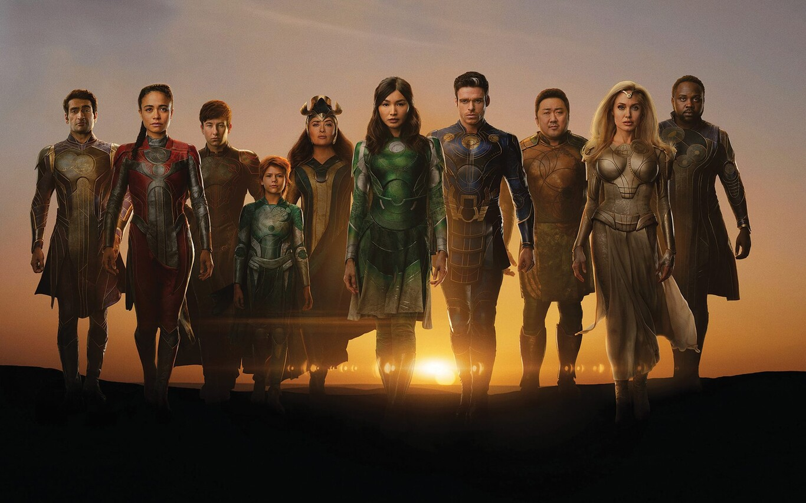

# ETERNALS

## Sinopsis

Cuando los Celestiales visitaron la Tierra hace un millón de años y realizaron experimentos genéticos en la protohumanidad temprana, crearon dos razas divergentes: los Eternos de larga vida y los Deviantes genéticamente inestables y monstruosamente grotescos. Estos experimentos también llevaron a la capacidad de mutaciones superpoderosas en humanos. También realizaron este experimento en otros planetas (como los mundos de origen Kree y Skrull) con resultados similares. 

A pesar de parecer humanos, los Eternos tienen una vida mucho más larga (pero originalmente no eran completamente inmortales) y eso les impidió tener mucho contacto con sus primos humanos. Los eternos tienen una tasa de natalidad baja; pueden cruzarse con humanos, pero el resultado es siempre un humano normal (aunque Joey Athena, hijo de Thena y un humano normal parece haberse convertido en un Eterno con propiedades y poderes de larga duración).20​A pesar de esto, los Eternos en general han protegido a la raza humana, especialmente de los Deviantes, con quienes siempre han tenido enemistad. Los Eternos también desarrollaron tecnología avanzada. 

Hace mucho tiempo, estalló una guerra civil entre los Eternos sobre la conquista de las otras razas, con una facción liderada por Kronos y la otra por su hermano guerrero, Uranos. El lado de Kronos prevaleció, y Uranos y su facción derrotada abandonaron la Tierra y viajaron a Urano, donde construyeron una colonia. Algunos miembros del grupo de Uranos pronto intentaron regresar a la Tierra para reavivar la guerra, pero fueron atacados por una nave Kree que pasaba y obligados a aterrizar en Titán, la luna de Saturno. Allí construyeron otra colonia (los experimentos realizados por los científicos Kree en un Eterno capturado los llevaron a ir a la Tierra y realizar sus propios experimentos genéticos en un grupo de humanos, creando así los Inhumanos). 

Un día, los experimentos de Kronos en energía cósmica provocaron una liberación catastrófica de energía en toda la ciudad de los Eternos, Titanos, destruyéndola, activando genes latentes en los Eternos y desintegrando el cuerpo del científico. Los Eternos ahora descubrieron que podían canalizar grandes cantidades de energía cósmica ellos mismos, otorgándoles un poder casi divino. El accidente dejó a Kronos en un estado inmaterial, por lo que hubo que elegir un nuevo líder. Por primera vez, los Eternos se fusionaron en un solo ser, la Uni-Mente, para decidir cuál de los hijos de Kronos, Zuras o A'lars, debería ser el nuevo líder. Zuras fue elegido para ser el Primer Eterno, y A'lars eligió dejar la Tierra para evitar causar otra guerra civil y viajó a Titán. 
