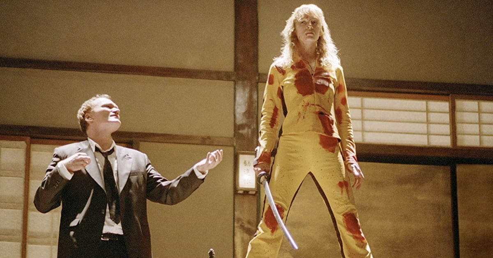

# KILL BILL V.1

## Sinopsis

El día de su boda, una asesina profesional (Thurman) sufre el ataque de algunos miembros de su propia banda, que obedecen las órdenes de Bill (David Carradine), el jefe de la organización criminal. Logra sobrevivir al ataque, aunque queda en coma. Cuatro años después despierta dominada por un gran deseo de venganza.

> “Para aquellos que son guerreros, cuando se enfrentan en combate, el aniquilamiento del enemigo debe ser la única preocupación. Suprimir toda emoción y compasión humana. Matar a quien quiera que se ponga en el camino, aún si es el mismo Dios, o Buda. Esta verdad está en el corazón del arte de combatir.”

> “La venganza nunca es un camino recto. Es como un bosque, y es fácil perderse.”

